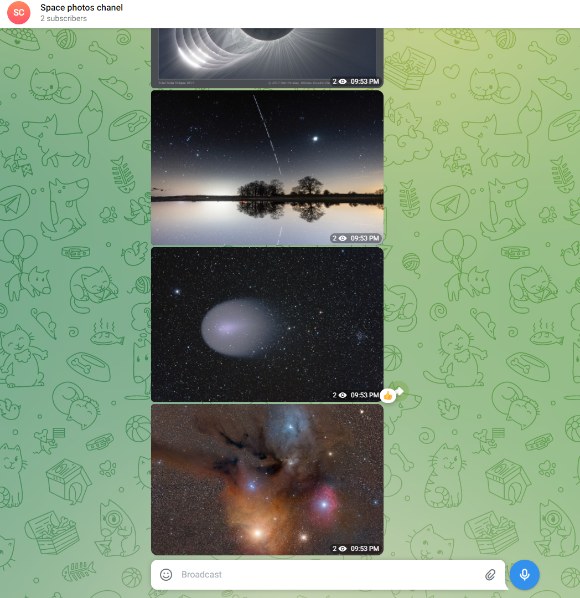

# NASA's space photo bot

## Project description

The script downloads photos from SpaceX and NASA and then published it in the telegram channel every day that you configure via environmental variables, to run the script type in the console:

```bash
python main.py
```

Example of message in channel:



## Instalation

Python3 should be already installed. Then use pip (or pip3, if there is a conflict with Python2) to install dependencies:

```bash
pip install -r requirements.txt
```

There is enviroment variables using in the application, you will need tp create ```.env``` file. A ```.env``` file is a text file containing key value pairs of all the environment variables required by the application. You can see example of it below:

```python
# example of environment variables defined inside a .env file
NASA_API_KEY=
TOKEN_TELEGRAM=1253123421:FFA1DSGOh_dfQACXYT5IiQwEBP5CwJozyP8
CHANNEL_ID=@space_photos_ch
SLEEP_TIME=3600
```

NASA_API_KEY = to get it go [here](https://api.nasa.gov/) and follow the instructions
TOKEN_TELEGRAM - to get it please writte to Telegram @BotFather bot, first you shall ```/start``` command, than ```/newbot```, than follow the instruction in Telegram.  
CHANNEL_ID - create channel and take link from it.
SLEEP_TIME - sleep time (time gap between two messages) in seconds

## Project Goals

The code is written for educational purposes on online-course for web-developers [Devman](https://dvmn.org)
